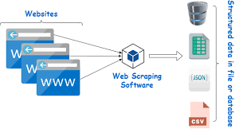

# 0x14. JavaScript - Web scraping

	

		
	

> ## General

- Why JavaScript programming is amazing
- How to manipulate JSON data
- How to use request and fetch API
- How to read and write a file using fs module

| Tasks      | Description | File |
| ----------- | ----------- |------|
| 0-Readme      | Write a script that reads and prints the content of a file | [0-Readme](https://github.com/hmachacom/holbertonschool-higher_level_programming/blob/main/0x14-javascript-web_scraping/0-readme.js) |
| 1. Write me   | Write a script that writes a string to a file.       | [1-Write me](https://github.com/hmachacom/holbertonschool-higher_level_programming/blob/main/0x14-javascript-web_scraping/1-writeme.js)|
| 2. Status code | Write a script that display the status code of a GET request. | [2. Status code](2-statuscode.js) |
|3. Star wars movie title| Write a script that prints the title of a Star Wars movie where the episode number matches a given integer.|[3. Star wars movie title](3-starwars_title.js) |
|4. Star wars Wedge Antilles | Write a script that prints the number of movies where the character “Wedge Antilles” is present.|[4. Star wars Wedge Antilles](4-starwars_count.js) |
| 5. Loripsum | Write a script that gets the contents of a webpage and stores it in a file. | [5. Loripsum](5-request_store.js)|
| 6. How many completed? | Write a script that computes the number of tasks completed by user id.| [6. How many completed?](6-completed_tasks.js) |

